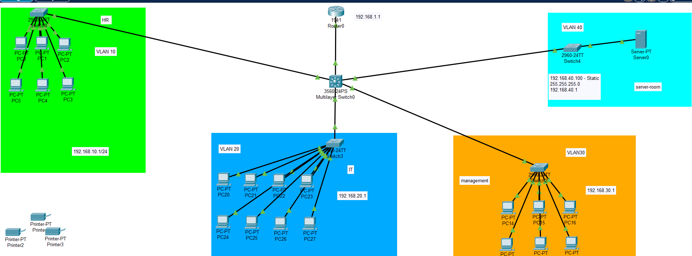

<h1 align="center">TechNova Networking Project</h1>

Small Office Network Infrastructure Design | VLAN Segmentation | IPv4/IPv6 | Routing | Security

<h2>📖 Scenario Overview</h2>

<strong>TechNova Solutions</strong> is a startup with 20 employees.
The company requires a secure, scalable, and efficient network infrastructure
to support daily operations such as internet access, file sharing,
internal communication, and remote access.

<h2>🖥 Network Topology Diagram</h2>

  

<h2>🎯 Project Objectives</h2>

<ol>
<li>Design a physical and logical network infrastructure using Cisco Packet Tracer.</li>
<li>Implement IPv4 and IPv6 addressing schemes.</li>
<li>Segment the network using VLANs for HR, IT, and Management departments.</li>
<li>Apply subnetting to optimize IP address usage.</li>
<li>Configure switching for internal communication between devices.</li>
<li>Set up static routing between networks using routers.</li>
<li>Enable secure device management via SSH.</li>
<li>Configure DHCP to automate IP address assignment.</li>
<li>Set up DNS to resolve internal hostnames.</li>
<li>Implement a web server for internal HTTP hosting.</li>
<li>Configure FTP for internal file transfers.</li>
<li>Apply basic security practices to restrict unauthorized access.</li>
<li>Map tasks and configurations to the OSI model.</li>
</ol>

<h2>📌 Project Implementation Phases</h2>

<h3>Phase 1: Network Planning & Design</h3>
<ul>
<li>Create a network topology diagram for the office.</li>
<li>Select routers, switches, PCs, printers, and servers.</li>
<li>Design VLAN layout based on departments.</li>
</ul>

<h3>Phase 2: IP Addressing Scheme</h3>
<ul>
<li>Design IPv4 subnets for each department.</li>
<li>Assign IPv6 addresses to network segments.</li>
</ul>

<h3>Phase 3: Device Configuration</h3>
<ul>
<li>Configure routers and switches with hostnames and IP addresses.</li>
<li>Configure VLANs on switches and assign ports.</li>
<li>Set up trunk ports for VLAN traffic.</li>
</ul>

<h3>Phase 4: Static Routing</h3>
<ul>
<li>Implement static routes to allow communication between VLANs.</li>
</ul>

<h3>Phase 5: Secure Access Setup</h3>
<ul>
<li>Configure SSH on routers for secure remote management.</li>
</ul>

<h3>Phase 6: DHCP Configuration</h3>
<ul>
<li>Set up DHCP services to assign IPs dynamically.</li>
</ul>

<h3>Phase 7: DNS, HTTP, FTP Services</h3>
<ul>
<li>Deploy a server to host DNS, HTTP, and FTP.</li>
<li>Configure internal domain resolution.</li>
<li>Enable FTP file transfers.</li>
</ul>

<h3>Phase 8: Testing & Troubleshooting</h3>
<ul>
<li>Use ping, traceroute, and SSH to verify connectivity.</li>
<li>Validate VLAN segmentation and routing.</li>
<li>Verify access to web and FTP services.</li>
</ul>

<h3>Phase 9: OSI Model Mapping</h3>
<ul>
<li>Document how configurations align with OSI layers.</li>
</ul>

<h2>🛠 Technologies Used</h2>

<ul>
<li>Cisco Packet Tracer</li>
<li>IPv4 & IPv6 Addressing</li>
<li>VLAN Segmentation</li>
<li>Inter-VLAN Routing</li>
<li>Static Routing</li>
<li>SSH Secure Management</li>
<li>DHCP</li>
<li>DNS</li>
<li>HTTP & FTP Services</li>
<li>OSI Model Mapping</li>
</ul>

<h2>📂 Repository Structure</h2>

<pre>
Technova-networking-project/
│
├── README.md
├── topology.pkt
└── screenshots/
    └── topology.png
</pre>

<strong>Author:</strong> Olamilekan Abiola  
Network & Security Enthusiast

